Using R to Visualize Data
================
Data Services @ HSL
8/9/2018

This session will cover fundamental concepts for creating effective data visualization and will introduce tools and techniques for visualizing large, high-dimensional data using R. We will review fundamental concepts for visually displaying quantitative information, such as using series of small multiples, avoiding "chart-junk," and maximizing the data-ink ratio. We will cover the grammar of graphics (geoms, aesthetics, stats, and faceting) using the ggplot2 package to create plots layer-by-layer.

This lesson assumes a basic familiarity with R, data frames, and manipulating data with tidyr, dplyr and the pipe `%>%`.

In this session, we will use the following packages: - tidyverse - or readr, dplyr, & ggplot2

``` r
library(tidyverse)
```

    ## ── Attaching packages ─────────────────────────────────────────── tidyverse 1.2.1 ──

    ## ✔ ggplot2 2.2.1     ✔ purrr   0.2.5
    ## ✔ tibble  1.4.2     ✔ dplyr   0.7.6
    ## ✔ tidyr   0.8.1     ✔ stringr 1.3.1
    ## ✔ readr   1.1.1     ✔ forcats 0.3.0

    ## Warning: package 'dplyr' was built under R version 3.5.1

    ## ── Conflicts ────────────────────────────────────────────── tidyverse_conflicts() ──
    ## ✖ dplyr::filter() masks stats::filter()
    ## ✖ dplyr::lag()    masks stats::lag()

### Download data and skeleton script from GitHub into project

Go to GitHub [repo](https://github.com/mariekekjones/BIMS-bootcamp) to get these materials

### NHANES data

The data we're going to work with comes from the National Health and Nutrition Examination Survey (NHANES) program at the CDC. You can read a lot more about NHANES on the [CDC's website](http://www.cdc.gov/nchs/nhanes/) or [Wikipedia](https://en.wikipedia.org/wiki/National_Health_and_Nutrition_Examination_Survey).

NHANES is a research program designed to assess the health and nutritional status of adults and children in the United States. The survey is one of the only to combine both survey questions and physical examinations. It began in the 1960s and since 1999 examines a nationally representative sample of about 5,000 people each year. The NHANES interview includes demographic, socioeconomic, dietary, and health-related questions. The physical exam includes medical, dental, and physiological measurements, as well as several standard laboratory tests. NHANES is used to determine the prevalence of major diseases and risk factors for those diseases. NHANES data are also the basis for national standards for measurements like height, weight, and blood pressure. Data from this survey is used in epidemiology studies and health sciences research, which help develop public health policy, direct and design health programs and services, and expand the health knowledge for the Nation.

We are using a small slice of this data. We're only using a handful of variables from the 2011-2012 survey years on about 5,000 individuals. The CDC uses a [sampling strategy](http://www.cdc.gov/nchs/data/series/sr_02/sr02_162.pdf) to purposefully oversample certain subpopulations like racial minorities. Naive analysis of the original NHANES data can lead to mistaken conclusions because the percentages of people from each racial group in the data are different from general population. The 5,000 individuals here are resampled from the larger NHANES study population to undo these oversampling effects, so you can treat this as if it were a simple random sample from the American population.

Let's read in the data to an object called `nh` and take a look with `View`. Remember, we need to load both the dplyr and readr packages (or tidyverse) for efficiently reading in and displaying this data.

``` r
# Read in downloaded data using readr package
nh <- read_csv(file="nhanes.csv")
```

    ## Parsed with column specification:
    ## cols(
    ##   .default = col_integer(),
    ##   Gender = col_character(),
    ##   Race = col_character(),
    ##   Education = col_character(),
    ##   MaritalStatus = col_character(),
    ##   RelationshipStatus = col_character(),
    ##   Insured = col_character(),
    ##   Poverty = col_double(),
    ##   HomeOwn = col_character(),
    ##   Work = col_character(),
    ##   Weight = col_double(),
    ##   Height = col_double(),
    ##   BMI = col_double(),
    ##   Testosterone = col_double(),
    ##   HDLChol = col_double(),
    ##   TotChol = col_double(),
    ##   Diabetes = col_character(),
    ##   PhysActive = col_character(),
    ##   SmokingStatus = col_character()
    ## )

    ## See spec(...) for full column specifications.

``` r
# Show the first few lines of the data and the dimensions
nh
```

    ## # A tibble: 5,000 x 32
    ##       id Gender   Age Race    Education    MaritalStatus RelationshipStat…
    ##    <int> <chr>  <int> <chr>   <chr>        <chr>         <chr>            
    ##  1 62163 male      14 Asian   <NA>         <NA>          <NA>             
    ##  2 62172 female    43 Black   High School  NeverMarried  Single           
    ##  3 62174 male      80 White   College Grad Married       Committed        
    ##  4 62174 male      80 White   College Grad Married       Committed        
    ##  5 62175 male       5 White   <NA>         <NA>          <NA>             
    ##  6 62176 female    34 White   College Grad Married       Committed        
    ##  7 62178 male      80 White   High School  Widowed       Single           
    ##  8 62180 male      35 White   College Grad Married       Committed        
    ##  9 62186 female    17 Black   <NA>         <NA>          <NA>             
    ## 10 62190 female    15 Mexican <NA>         <NA>          <NA>             
    ## # ... with 4,990 more rows, and 25 more variables: Insured <chr>,
    ## #   Income <int>, Poverty <dbl>, HomeRooms <int>, HomeOwn <chr>,
    ## #   Work <chr>, Weight <dbl>, Height <dbl>, BMI <dbl>, Pulse <int>,
    ## #   BPSys <int>, BPDia <int>, Testosterone <dbl>, HDLChol <dbl>,
    ## #   TotChol <dbl>, Diabetes <chr>, DiabetesAge <int>, nPregnancies <int>,
    ## #   nBabies <int>, SleepHrsNight <int>, PhysActive <chr>,
    ## #   PhysActiveDays <int>, AlcoholDay <int>, AlcoholYear <int>,
    ## #   SmokingStatus <chr>

``` r
# Optionally bring up data in a viewer window.
# View(nh)
```

This particular excerpt has 5000 observations of 32 variables

### dplyr review

For those of you who were here for the Intro session yesterday, this will be a review. For those of you new to the tidyverse, this is exciting stuff!

The dplyr package gives you a handful of useful **verbs** for managing data. On their own they don't do anything that base R can't do. Here are some of the *single-table* verbs we'll cover briefly in this lesson (single-table meaning that they only work on a single table -- contrast that to *two-table* verbs used for joining data together). They all take a `data.frame` or `tbl` as their input for the first argument, and they all return a `data.frame` or `tbl` as output.

Show how to access dplyr cheat sheet from `Help` menu

1.  `filter()`: filters *rows* of the data where some condition is true
2.  `group_by()`: groups a data frame by one or more variable. Most data operations are useful done on groups defined by variables in the the dataset. The `group_by` function takes an existing data frame and converts it into a grouped data frame where `summarize()` operations are performed *by group*.
3.  `summarize()`: summarizes multiple values to a single value, most useful when combined with `group_by()`

dplyr takes a tibble dataframe as its first argument and then a logical condition to meet as the second argument.

-   `==`: Equal to
-   `!=`: Not equal to
-   `>`, `>=`: Greater than, greater than or equal to
-   `<`, `<=`: Less than, less than or equal to

If you want to satisfy *all* of multiple conditions, you can use the "and" operator, `&`. The "or" operator `|` (the pipe character, usually shift-backslash) will return a subset that meet *any* of the conditions.

Let's use filter to return rows where the person was elderly (defined as &gt;= 80 years old)

``` r
filter(nh, Age >= 80)
```

    ## # A tibble: 177 x 32
    ##       id Gender   Age Race    Education    MaritalStatus RelationshipStat…
    ##    <int> <chr>  <int> <chr>   <chr>        <chr>         <chr>            
    ##  1 62174 male      80 White   College Grad Married       Committed        
    ##  2 62174 male      80 White   College Grad Married       Committed        
    ##  3 62178 male      80 White   High School  Widowed       Single           
    ##  4 62256 male      80 White   8th Grade    Married       Committed        
    ##  5 62279 male      80 Black   9 - 11th Gr… Widowed       Single           
    ##  6 62279 male      80 Black   9 - 11th Gr… Widowed       Single           
    ##  7 62366 male      80 White   High School  Married       Committed        
    ##  8 62368 female    80 Hispan… 8th Grade    Widowed       Single           
    ##  9 62418 male      80 White   8th Grade    Widowed       Single           
    ## 10 62418 male      80 White   8th Grade    Widowed       Single           
    ## # ... with 167 more rows, and 25 more variables: Insured <chr>,
    ## #   Income <int>, Poverty <dbl>, HomeRooms <int>, HomeOwn <chr>,
    ## #   Work <chr>, Weight <dbl>, Height <dbl>, BMI <dbl>, Pulse <int>,
    ## #   BPSys <int>, BPDia <int>, Testosterone <dbl>, HDLChol <dbl>,
    ## #   TotChol <dbl>, Diabetes <chr>, DiabetesAge <int>, nPregnancies <int>,
    ## #   nBabies <int>, SleepHrsNight <int>, PhysActive <chr>,
    ## #   PhysActiveDays <int>, AlcoholDay <int>, AlcoholYear <int>,
    ## #   SmokingStatus <chr>

The dplyr package also imports functionality from the [magrittr](https://github.com/smbache/magrittr) package that lets you *pipe* the output of one function to the input of another, so you can avoid nesting functions. It looks like this: **`%>%`**. You don't have to load the magrittr package to use it since it is part of dplyr too.

Here's the simplest way to use the pipe. Remember the `head()` function. It expects a data frame as input, and the next argument is the number of lines to print. These two commands are identical:

``` r
head(nh, 5)
```

    ## # A tibble: 5 x 32
    ##      id Gender   Age Race  Education    MaritalStatus RelationshipStatus
    ##   <int> <chr>  <int> <chr> <chr>        <chr>         <chr>             
    ## 1 62163 male      14 Asian <NA>         <NA>          <NA>              
    ## 2 62172 female    43 Black High School  NeverMarried  Single            
    ## 3 62174 male      80 White College Grad Married       Committed         
    ## 4 62174 male      80 White College Grad Married       Committed         
    ## 5 62175 male       5 White <NA>         <NA>          <NA>              
    ## # ... with 25 more variables: Insured <chr>, Income <int>, Poverty <dbl>,
    ## #   HomeRooms <int>, HomeOwn <chr>, Work <chr>, Weight <dbl>,
    ## #   Height <dbl>, BMI <dbl>, Pulse <int>, BPSys <int>, BPDia <int>,
    ## #   Testosterone <dbl>, HDLChol <dbl>, TotChol <dbl>, Diabetes <chr>,
    ## #   DiabetesAge <int>, nPregnancies <int>, nBabies <int>,
    ## #   SleepHrsNight <int>, PhysActive <chr>, PhysActiveDays <int>,
    ## #   AlcoholDay <int>, AlcoholYear <int>, SmokingStatus <chr>

``` r
nh %>% head(5)
```

    ## # A tibble: 5 x 32
    ##      id Gender   Age Race  Education    MaritalStatus RelationshipStatus
    ##   <int> <chr>  <int> <chr> <chr>        <chr>         <chr>             
    ## 1 62163 male      14 Asian <NA>         <NA>          <NA>              
    ## 2 62172 female    43 Black High School  NeverMarried  Single            
    ## 3 62174 male      80 White College Grad Married       Committed         
    ## 4 62174 male      80 White College Grad Married       Committed         
    ## 5 62175 male       5 White <NA>         <NA>          <NA>              
    ## # ... with 25 more variables: Insured <chr>, Income <int>, Poverty <dbl>,
    ## #   HomeRooms <int>, HomeOwn <chr>, Work <chr>, Weight <dbl>,
    ## #   Height <dbl>, BMI <dbl>, Pulse <int>, BPSys <int>, BPDia <int>,
    ## #   Testosterone <dbl>, HDLChol <dbl>, TotChol <dbl>, Diabetes <chr>,
    ## #   DiabetesAge <int>, nPregnancies <int>, nBabies <int>,
    ## #   SleepHrsNight <int>, PhysActive <chr>, PhysActiveDays <int>,
    ## #   AlcoholDay <int>, AlcoholYear <int>, SmokingStatus <chr>

Now let's use the pipe operator with filter

``` r
filter(nh, Age >= 80) #without pipe
```

    ## # A tibble: 177 x 32
    ##       id Gender   Age Race    Education    MaritalStatus RelationshipStat…
    ##    <int> <chr>  <int> <chr>   <chr>        <chr>         <chr>            
    ##  1 62174 male      80 White   College Grad Married       Committed        
    ##  2 62174 male      80 White   College Grad Married       Committed        
    ##  3 62178 male      80 White   High School  Widowed       Single           
    ##  4 62256 male      80 White   8th Grade    Married       Committed        
    ##  5 62279 male      80 Black   9 - 11th Gr… Widowed       Single           
    ##  6 62279 male      80 Black   9 - 11th Gr… Widowed       Single           
    ##  7 62366 male      80 White   High School  Married       Committed        
    ##  8 62368 female    80 Hispan… 8th Grade    Widowed       Single           
    ##  9 62418 male      80 White   8th Grade    Widowed       Single           
    ## 10 62418 male      80 White   8th Grade    Widowed       Single           
    ## # ... with 167 more rows, and 25 more variables: Insured <chr>,
    ## #   Income <int>, Poverty <dbl>, HomeRooms <int>, HomeOwn <chr>,
    ## #   Work <chr>, Weight <dbl>, Height <dbl>, BMI <dbl>, Pulse <int>,
    ## #   BPSys <int>, BPDia <int>, Testosterone <dbl>, HDLChol <dbl>,
    ## #   TotChol <dbl>, Diabetes <chr>, DiabetesAge <int>, nPregnancies <int>,
    ## #   nBabies <int>, SleepHrsNight <int>, PhysActive <chr>,
    ## #   PhysActiveDays <int>, AlcoholDay <int>, AlcoholYear <int>,
    ## #   SmokingStatus <chr>

``` r
nh %>% filter(Age >= 80) #pipe!
```

    ## # A tibble: 177 x 32
    ##       id Gender   Age Race    Education    MaritalStatus RelationshipStat…
    ##    <int> <chr>  <int> <chr>   <chr>        <chr>         <chr>            
    ##  1 62174 male      80 White   College Grad Married       Committed        
    ##  2 62174 male      80 White   College Grad Married       Committed        
    ##  3 62178 male      80 White   High School  Widowed       Single           
    ##  4 62256 male      80 White   8th Grade    Married       Committed        
    ##  5 62279 male      80 Black   9 - 11th Gr… Widowed       Single           
    ##  6 62279 male      80 Black   9 - 11th Gr… Widowed       Single           
    ##  7 62366 male      80 White   High School  Married       Committed        
    ##  8 62368 female    80 Hispan… 8th Grade    Widowed       Single           
    ##  9 62418 male      80 White   8th Grade    Widowed       Single           
    ## 10 62418 male      80 White   8th Grade    Widowed       Single           
    ## # ... with 167 more rows, and 25 more variables: Insured <chr>,
    ## #   Income <int>, Poverty <dbl>, HomeRooms <int>, HomeOwn <chr>,
    ## #   Work <chr>, Weight <dbl>, Height <dbl>, BMI <dbl>, Pulse <int>,
    ## #   BPSys <int>, BPDia <int>, Testosterone <dbl>, HDLChol <dbl>,
    ## #   TotChol <dbl>, Diabetes <chr>, DiabetesAge <int>, nPregnancies <int>,
    ## #   nBabies <int>, SleepHrsNight <int>, PhysActive <chr>,
    ## #   PhysActiveDays <int>, AlcoholDay <int>, AlcoholYear <int>,
    ## #   SmokingStatus <chr>

### Nesting v. %&gt;%

Let's say we want to see the mean height, grouped by Race, only for adults.

The way you do this without pipes is completely inside-out and backwards from the way you express in words and in thought what you want to do. Because the arguments belonging to a function get pushed farther and father away from the function name as you add more nesting elements, that results in messy, unreadable code.

``` r
summarize(group_by(filter(nh, Age >= 18), Race), meanHeight=mean(Height, na.rm = TRUE))
```

    ## # A tibble: 6 x 2
    ##   Race     meanHeight
    ##   <chr>         <dbl>
    ## 1 Asian          164.
    ## 2 Black          169.
    ## 3 Hispanic       164.
    ## 4 Mexican        165.
    ## 5 Other          170.
    ## 6 White          170.

Compare this code with the mental process of what you're actually trying to accomplish.

Really what we want to do: 1. take nh THEN 1. filter for adults THEN 1. group\_by Race THEN 1. summarize mean Height and remove NAs

The pipe operator `%>%` allows us to group the arguments with their function and order the functions in the same order as we want to do them. In this way we can pass the output tibble from one function to the input tibble of the next function.

``` r
nh %>%
  filter(Age >= 18) %>%
  group_by(Race) %>%
  summarize(meanHeight = mean(Height, na.rm = TRUE))
```

    ## # A tibble: 6 x 2
    ##   Race     meanHeight
    ##   <chr>         <dbl>
    ## 1 Asian          164.
    ## 2 Black          169.
    ## 3 Hispanic       164.
    ## 4 Mexican        165.
    ## 5 Other          170.
    ## 6 White          170.

``` r
#would be nice to see this list arranged in order
nh %>%
  filter(Age >= 18) %>%
  group_by(Race) %>%
  summarize(meanHeight = mean(Height, na.rm = TRUE)) %>%
  arrange(meanHeight)
```

    ## # A tibble: 6 x 2
    ##   Race     meanHeight
    ##   <chr>         <dbl>
    ## 1 Asian          164.
    ## 2 Hispanic       164.
    ## 3 Mexican        165.
    ## 4 Black          169.
    ## 5 Other          170.
    ## 6 White          170.

#### \*\* EXERCISE 1 ** ** YOUR TURN \*\* A. How many observations are there of children (&lt; 18 years old)? B. How many cases of obese children are there (BMI &gt;= 30)? C. Use `filter()`, `group_by()` and `summarize()` to find the mean BMI by Smoking Status for only Adults who have Diabetes. Do diabetic smokers or non-smokers have higher BMI?

``` r
#A
nh %>% 
  filter(Age < 18)
```

    ## # A tibble: 1,293 x 32
    ##       id Gender   Age Race     Education MaritalStatus RelationshipStatus
    ##    <int> <chr>  <int> <chr>    <chr>     <chr>         <chr>             
    ##  1 62163 male      14 Asian    <NA>      <NA>          <NA>              
    ##  2 62175 male       5 White    <NA>      <NA>          <NA>              
    ##  3 62186 female    17 Black    <NA>      <NA>          <NA>              
    ##  4 62190 female    15 Mexican  <NA>      <NA>          <NA>              
    ##  5 62210 male      15 White    <NA>      <NA>          <NA>              
    ##  6 62219 female     2 Mexican  <NA>      <NA>          <NA>              
    ##  7 62225 female    13 Mexican  <NA>      <NA>          <NA>              
    ##  8 62235 female     2 White    <NA>      <NA>          <NA>              
    ##  9 62241 male       2 Hispanic <NA>      <NA>          <NA>              
    ## 10 62257 female     2 Mexican  <NA>      <NA>          <NA>              
    ## # ... with 1,283 more rows, and 25 more variables: Insured <chr>,
    ## #   Income <int>, Poverty <dbl>, HomeRooms <int>, HomeOwn <chr>,
    ## #   Work <chr>, Weight <dbl>, Height <dbl>, BMI <dbl>, Pulse <int>,
    ## #   BPSys <int>, BPDia <int>, Testosterone <dbl>, HDLChol <dbl>,
    ## #   TotChol <dbl>, Diabetes <chr>, DiabetesAge <int>, nPregnancies <int>,
    ## #   nBabies <int>, SleepHrsNight <int>, PhysActive <chr>,
    ## #   PhysActiveDays <int>, AlcoholDay <int>, AlcoholYear <int>,
    ## #   SmokingStatus <chr>

``` r
#B
nh %>% 
  filter(Age < 18 & BMI >= 30)
```

    ## # A tibble: 65 x 32
    ##       id Gender   Age Race    Education MaritalStatus RelationshipStatus
    ##    <int> <chr>  <int> <chr>   <chr>     <chr>         <chr>             
    ##  1 62285 female    17 White   <NA>      <NA>          <NA>              
    ##  2 62285 female    17 White   <NA>      <NA>          <NA>              
    ##  3 62313 male       7 Mexican <NA>      <NA>          <NA>              
    ##  4 62810 female    15 White   <NA>      <NA>          <NA>              
    ##  5 62870 male      13 Mexican <NA>      <NA>          <NA>              
    ##  6 62879 female    14 Black   <NA>      <NA>          <NA>              
    ##  7 62950 female    16 White   <NA>      <NA>          <NA>              
    ##  8 62950 female    16 White   <NA>      <NA>          <NA>              
    ##  9 63072 female    12 White   <NA>      <NA>          <NA>              
    ## 10 63350 male      16 White   <NA>      <NA>          <NA>              
    ## # ... with 55 more rows, and 25 more variables: Insured <chr>,
    ## #   Income <int>, Poverty <dbl>, HomeRooms <int>, HomeOwn <chr>,
    ## #   Work <chr>, Weight <dbl>, Height <dbl>, BMI <dbl>, Pulse <int>,
    ## #   BPSys <int>, BPDia <int>, Testosterone <dbl>, HDLChol <dbl>,
    ## #   TotChol <dbl>, Diabetes <chr>, DiabetesAge <int>, nPregnancies <int>,
    ## #   nBabies <int>, SleepHrsNight <int>, PhysActive <chr>,
    ## #   PhysActiveDays <int>, AlcoholDay <int>, AlcoholYear <int>,
    ## #   SmokingStatus <chr>

``` r
#C
nh %>%
  filter(Age >= 18 & Diabetes == "Yes") %>%
  group_by(SmokingStatus) %>%
  summarize(meanBMI = mean(BMI, na.rm = TRUE))
```

    ## # A tibble: 3 x 2
    ##   SmokingStatus meanBMI
    ##   <chr>           <dbl>
    ## 1 Current          31.0
    ## 2 Former           32.5
    ## 3 Never            33.6

Alternatively to answer C, you could have grouped by both Smoking Status and Diabetes to answer this question

``` r
nh %>%
  group_by(SmokingStatus, Diabetes) %>%
  summarize(meanBMI = mean(BMI, na.rm = TRUE))
```

    ## # A tibble: 9 x 3
    ## # Groups:   SmokingStatus [?]
    ##   SmokingStatus Diabetes meanBMI
    ##   <chr>         <chr>      <dbl>
    ## 1 Current       No          27.1
    ## 2 Current       Yes         31.0
    ## 3 Former        No          28.6
    ## 4 Former        Yes         32.5
    ## 5 Never         No          28.4
    ## 6 Never         Yes         33.6
    ## 7 <NA>          No          20.3
    ## 8 <NA>          Yes         22.9
    ## 9 <NA>          <NA>        22.2

Let's make some plots to examine the relationships between variables. We will be plotting using ggplot2

### About ggplot2

**ggplot2** is a widely used R package that extends R's visualization capabilities. It takes the hassle out of things like creating legends, mapping other variables to scales like color, or plotting multiple small plots together.

*Where does the "gg" in ggplot2 come from?* The **ggplot2** package provides an R implementation of Leland Wilkinson's *Grammar of Graphics* (1999). The *Grammar of Graphics* allows you to think beyond the garden variety plot types (e.g. scatterplot, barplot) and the consider the components that make up a plot or graphic, such as how data are represented on the plot (as lines, points, etc.), how variables are mapped to coordinates or plotting shape or color, what transformation or statistical summary is required, and so on.

Specifically, **ggplot2** allows you to build a plot layer-by-layer by specifying:

-   a **geom**, which specifies how the data are represented on the plot (points, lines, bars, etc.),
-   **aesthetics** that map variables in the data to axes on the plot or to plotting size, shape, color, etc.,
-   **facets**, which we've already seen above, that allow the data to be divided into chunks on the basis of other categorical or continuous variables and the same plot drawn for each chunk.

*First, a note about `qplot()`.* The `qplot()` function is a quick and dirty way of making ggplot2 plots. You might see it if you look for help with ggplot2, and it's even covered extensively in the ggplot2 book. And if you're used to making plots with built-in base graphics, the `qplot()` function will probably feel more familiar. But the sooner you abandon the `qplot()` syntax the sooner you'll start to really understand ggplot2's approach to building up plots layer by layer. So we're not going to use it at all in this class.

See [R Graphics Cookbook](http://www.cookbook-r.com/Graphs/) for more help with ggplot2.

### Scatterplots

Age (X) against Height (Y) (continuous X, continuous Y)

``` r
nh %>%
  ggplot(aes(x = Age, y = Height)) #what happened...why?
```


``` r
nh %>%
  ggplot(aes(x = Age, y = Height)) + geom_point()
```

    ## Warning: Removed 159 rows containing missing values (geom_point).

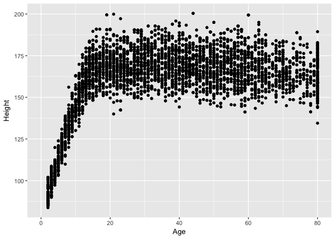

``` r
#color the points by Gender
nh %>%
  ggplot(aes(x= Age, y = Height)) + 
  geom_point(aes(color = Gender))
```

    ## Warning: Removed 159 rows containing missing values (geom_point).


``` r
#color the points blue and shape them as +
nh %>%
  ggplot(aes(x= Age, y = Height)) + 
  geom_point(color = "blue", shape = 3)
```

    ## Warning: Removed 159 rows containing missing values (geom_point).

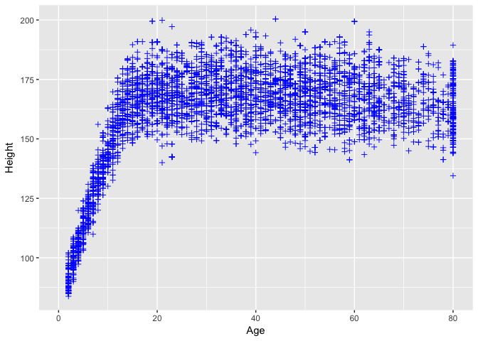

``` r
#what is the difference between coloring by a variable and coloring by static values
#color the points by Gender (again)
nh %>%
  ggplot(aes(x= Age, y = Height)) + 
  geom_point(aes(color = Gender))
```

    ## Warning: Removed 159 rows containing missing values (geom_point).

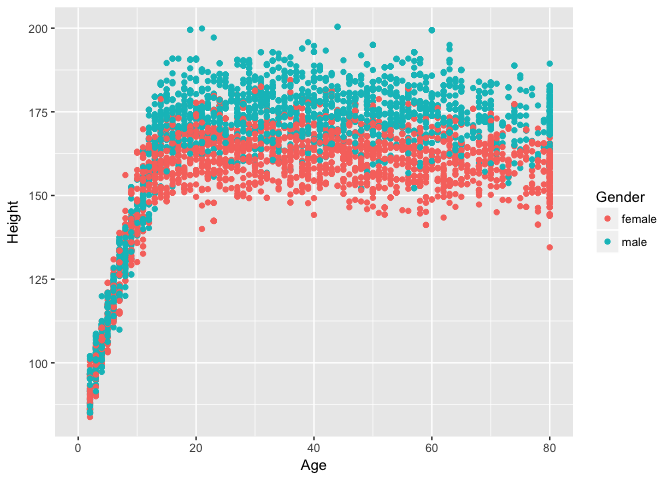

``` r
#plot points colored by Gender and smoothed line
nh %>%
  ggplot(aes(x= Age, y = Height)) +
  geom_point(aes(color = Gender)) + 
  geom_smooth() #both genders
```

    ## `geom_smooth()` using method = 'gam'

    ## Warning: Removed 159 rows containing non-finite values (stat_smooth).

    ## Warning: Removed 159 rows containing missing values (geom_point).


By default `geom_smooth()` will try to lowess (Locally Weighted Scatterplot Smoothing) for data with n&lt;1000 or GAM (Generalized Additive models) for data with n&gt;1000. (In the geom\_smooth help menu you can read all about these)

`geom_smooth()` using method = 'gam' and formula 'y ~ s(x, bs = "cs")'. The s = smoothing function. bs = basis of smoothing and cs = cubic regression spines with shrinkage

We can change the geom\_smooth() behavior by tweaking the parameters to color by Gender and use a LOESS instead of a GAM.

``` r
#plot smoothed trend line and points both colored by gender
nh %>%
  ggplot(aes(x= Age, y = Height)) +
  geom_point(aes(color = Gender)) + 
  geom_smooth(aes(color = Gender), method = "loess")
```

    ## Warning: Removed 159 rows containing non-finite values (stat_smooth).

    ## Warning: Removed 159 rows containing missing values (geom_point).

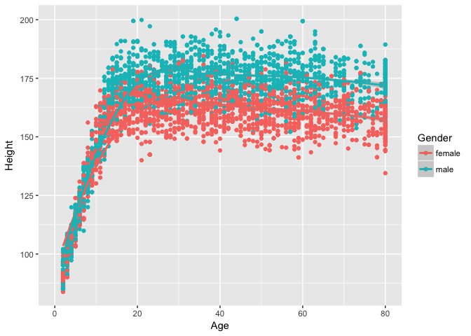

``` r
# color all layers by Gender
nh %>%
  ggplot(aes(x= Age, y = Height, color = Gender)) +
  geom_point() + 
  geom_smooth(method = "loess")
```

    ## Warning: Removed 159 rows containing non-finite values (stat_smooth).

    ## Warning: Removed 159 rows containing missing values (geom_point).


``` r
# color all layers by Gender, add transparency to points, make line bolder
nh %>%
  ggplot(aes(x= Age, y = Height, color = Gender)) +
  geom_point(alpha = .2) + 
  geom_smooth(method = "loess", lwd = 2)
```

    ## Warning: Removed 159 rows containing non-finite values (stat_smooth).

    ## Warning: Removed 159 rows containing missing values (geom_point).

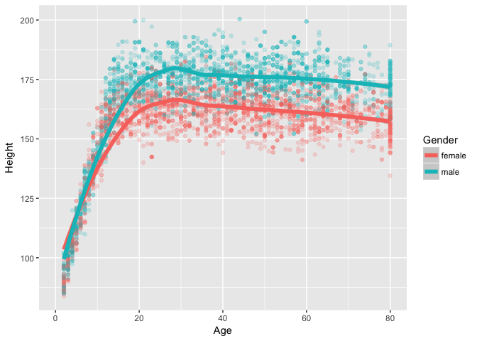

### \*\* EXERCISE 2 ** ** YOUR TURN \*\* A. Use a scatterplot to investigate the relationship between Age and Testosterone.

B. Color the plot in A by Gender.

C. Create the plot in A for just men.

D. Filter for men &gt; 65 and &lt; 80 years old and then examine the relationship between Age and Testosterone.

E. Does the relationship you saw in D differ if the man is physically active (PhysActive == "Yes")? Use colored loess lines to see the effect of physical activity.

``` r
#A
nh %>%
  ggplot(aes(x = Age, y = Testosterone)) + 
  geom_point()
```

    ## Warning: Removed 874 rows containing missing values (geom_point).


``` r
#B
#color by Gender
nh %>%
  ggplot(aes(x = Age, y = Testosterone)) + 
  geom_point(aes(color = Gender))
```

    ## Warning: Removed 874 rows containing missing values (geom_point).


``` r
#C
#just men
nh %>%
  filter(Gender == "male") %>%
  ggplot(aes(x = Age, y = Testosterone)) + 
  geom_point()
```

    ## Warning: Removed 429 rows containing missing values (geom_point).

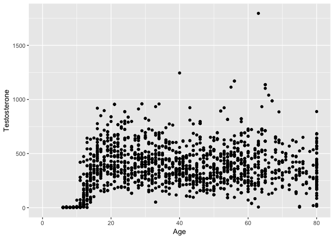

``` r
#D
nh %>%
  filter(Gender == "male" & Age > 65 & Age < 80) %>%
  ggplot(aes(x = Age, y = Testosterone)) + 
  geom_point()
```

    ## Warning: Removed 15 rows containing missing values (geom_point).


``` r
#E
nh %>%
  filter(Gender == "male" & Age > 65 & Age < 80) %>%
  ggplot(aes(x = Age, y = Testosterone)) + 
  geom_point() + 
  geom_smooth(aes(color = PhysActive))
```

    ## `geom_smooth()` using method = 'loess'

    ## Warning: Removed 15 rows containing non-finite values (stat_smooth).

    ## Warning: Removed 15 rows containing missing values (geom_point).

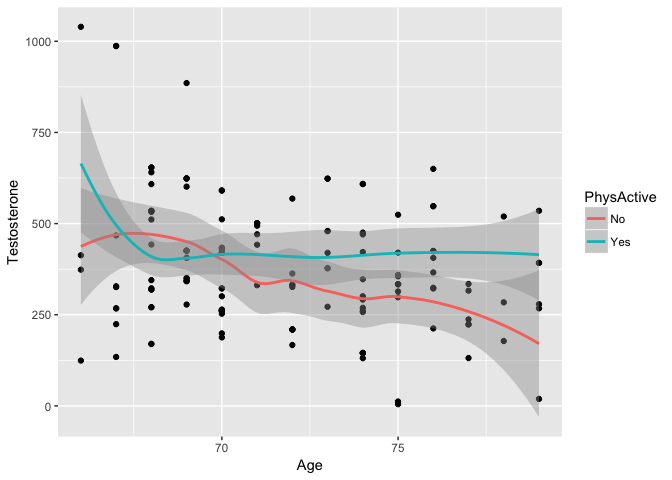

### Visualizations for discrete X

Above we were plotting a continuous X and a continuous Y. For visualizations with discrete X variables and continuous Y, boxplots will be shown instead of scatterplots.

Let's look at BMI by Smoking Status

``` r
#blank canvas, note categories on X
nh %>%
  ggplot(aes(x = SmokingStatus, y = BMI))
```


``` r
# try with geom point
nh %>%
  ggplot(aes(x = SmokingStatus, y = BMI)) + geom_point()
```

    ## Warning: Removed 166 rows containing missing values (geom_point).

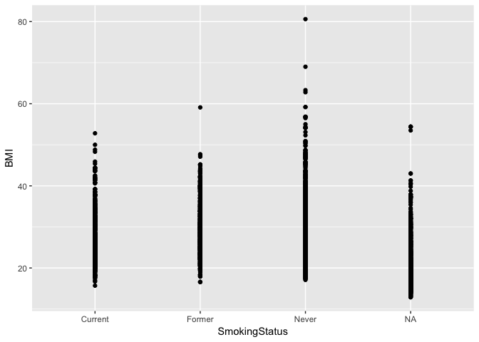

``` r
# no variability in X values --> overplotting

# so add some random variability to x-axis using geom_jitter()
nh %>%
  ggplot(aes(x = SmokingStatus, y = BMI)) + geom_jitter()
```

    ## Warning: Removed 166 rows containing missing values (geom_point).

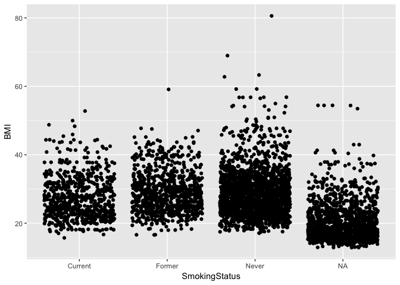

Note that the little bit of horizontal noise that's added to the jitter is random. If you run that command over and over again, each time it will look slightly different. The idea is to visualize the density at each vertical position, and spreading out the points horizontally allows you to do that. If there were still lots of over-plotting you might think about adding some transparency by setting the `alpha=` value for the jitter.

``` r
# remove NA category and add transparency
nh %>%
  filter(!is.na(SmokingStatus)) %>%
  ggplot(aes(x = SmokingStatus, y = BMI)) + 
  geom_jitter(alpha = .25)
```

    ## Warning: Removed 31 rows containing missing values (geom_point).

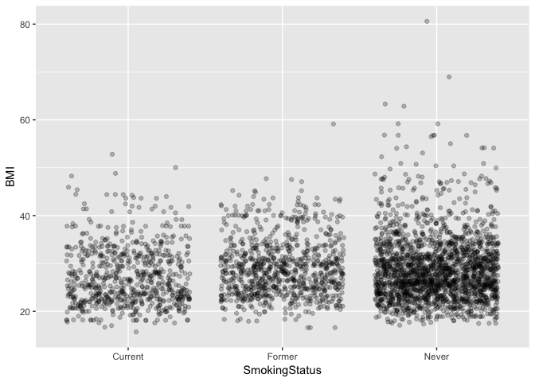

Probably a more common visualization for a discrete X is to show a box plot:

``` r
# categorical data can be plotted using boxplots
nh %>%
  filter(!is.na(SmokingStatus)) %>%
  ggplot(aes(x = SmokingStatus, y = BMI)) + 
  geom_boxplot()
```

    ## Warning: Removed 31 rows containing non-finite values (stat_boxplot).

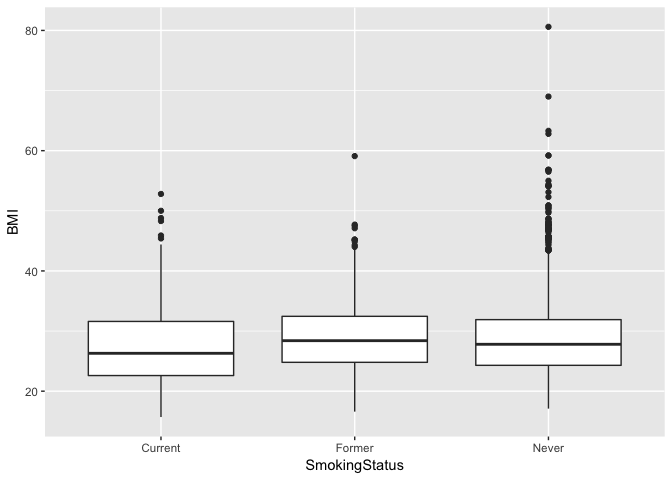

Why not try visualizing both the underlying data (jitter) and the summary (boxplot)

``` r
nh %>%
  filter(!is.na(SmokingStatus)) %>%
  ggplot(aes(x = SmokingStatus, y = BMI)) + 
  geom_jitter(alpha = .25) +
  geom_boxplot()
```

    ## Warning: Removed 31 rows containing non-finite values (stat_boxplot).

    ## Warning: Removed 31 rows containing missing values (geom_point).

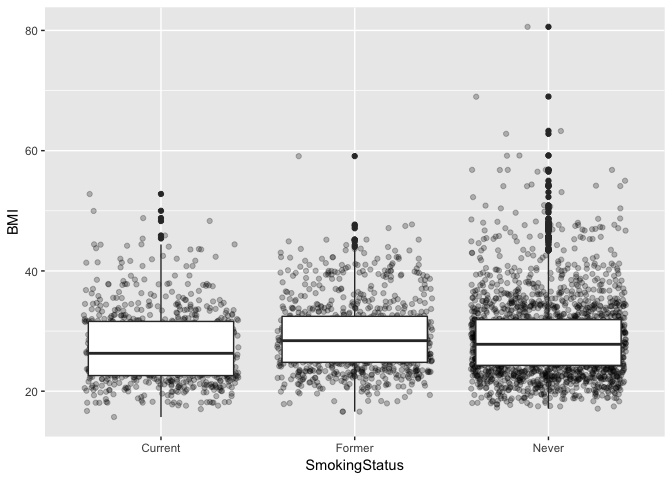

What can we do to improve the above plot?

``` r
#need to make boxplot transparent and deal with fact that outliers will be plotted twice, once per layer
nh %>%
  filter(!is.na(SmokingStatus)) %>%
  ggplot(aes(x = SmokingStatus, y = BMI)) + 
  geom_jitter(alpha = .25) +
  geom_boxplot(alpha = .5, outlier.colour = NA)
```

    ## Warning: Removed 31 rows containing non-finite values (stat_boxplot).

    ## Warning: Removed 31 rows containing missing values (geom_point).

 If we want to see the effect of Gender on this relationship, remove jittered points and color boxplots by Gender

``` r
nh %>%
  filter(!is.na(SmokingStatus)) %>%
  ggplot(aes(x = SmokingStatus, y = BMI)) + 
  geom_boxplot(aes(color = Gender))
```

    ## Warning: Removed 31 rows containing non-finite values (stat_boxplot).

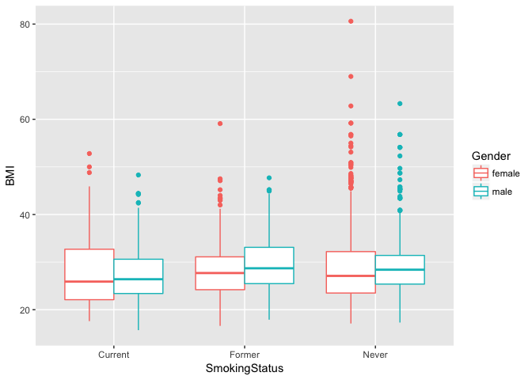

That is not exactly what I wanted. I wanted to fill the whole box with color. Argument is fill instead of color

``` r
nh %>%
  filter(!is.na(SmokingStatus)) %>%
  ggplot(aes(x = SmokingStatus, y = BMI)) + 
  geom_boxplot(aes(fill= Gender))
```

    ## Warning: Removed 31 rows containing non-finite values (stat_boxplot).

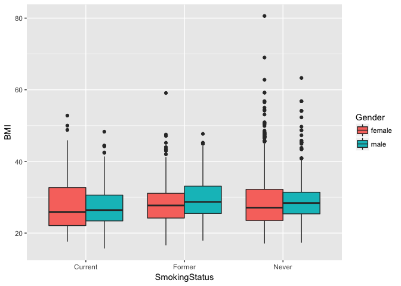

### **EXERCISE 3**

\*\* YOUR TURN \*\* A. Create boxplots showing height for Adults of different Races

B. Add jittered data under boxplots in A.

C. Color boxplots in A by Gender

``` r
#A.
nh %>%
  filter(Age > 18) %>%
  ggplot(aes(x = Race, y= Height)) +
  geom_boxplot()
```

    ## Warning: Removed 26 rows containing non-finite values (stat_boxplot).


``` r
#B. 
nh %>%
  filter(Age > 18) %>%
  ggplot(aes(x = Race, y= Height)) +
  geom_jitter(alpha = .25) +
  geom_boxplot(alpha = .7, outlier.colour = NA)
```

    ## Warning: Removed 26 rows containing non-finite values (stat_boxplot).

    ## Warning: Removed 26 rows containing missing values (geom_point).

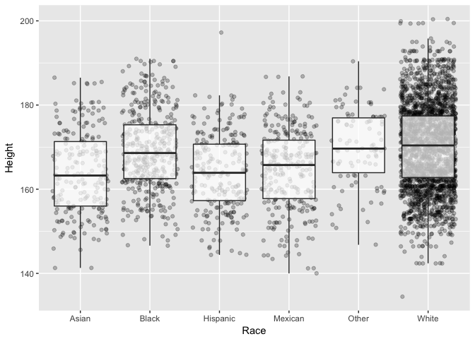

``` r
#C.
nh %>%
  filter(Age > 18) %>%
  ggplot(aes(x = Race, y= Height)) +
  geom_boxplot(aes(fill = Gender))
```

    ## Warning: Removed 26 rows containing non-finite values (stat_boxplot).


### Plotting univariate continuous data

What if we just wanted to visualize distribution of a single continuous variable? A histogram is the usual go-to visualization. Here we only have one aesthetic mapping instead of two.

``` r
nh %>%
  ggplot(aes(Height))
```

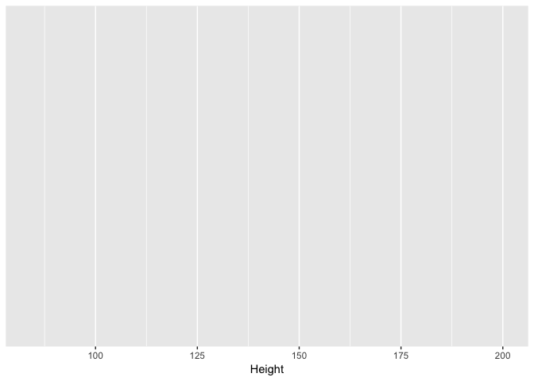

``` r
#save canvas as p then add histogram
p <- nh %>%
  ggplot(aes(Height))

p + geom_histogram()
```

    ## `stat_bin()` using `bins = 30`. Pick better value with `binwidth`.

    ## Warning: Removed 159 rows containing non-finite values (stat_bin).


Interesting shape because this includes children. When we do this ggplot lets us know that we're automatically selecting the width of the bins, and we might want to think about this a little further.

``` r
p + geom_histogram(bins=30)
```

    ## Warning: Removed 159 rows containing non-finite values (stat_bin).


``` r
p + geom_histogram(bins=10)
```

    ## Warning: Removed 159 rows containing non-finite values (stat_bin).


``` r
p + geom_histogram(bins=200)
```

    ## Warning: Removed 159 rows containing non-finite values (stat_bin).

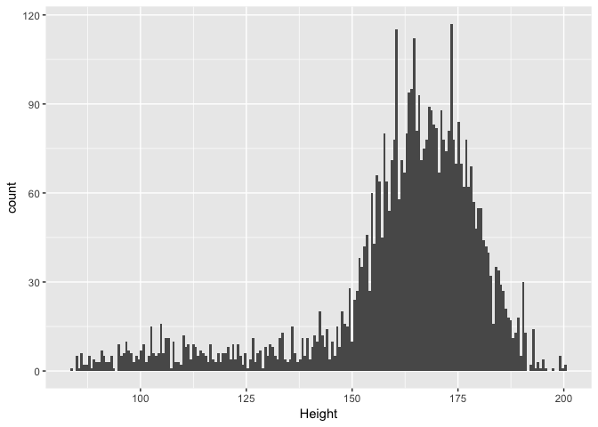

``` r
p + geom_histogram(bins=60)
```

    ## Warning: Removed 159 rows containing non-finite values (stat_bin).


Alternatively we could plot a smoothed density curve instead of a histogram:

``` r
p + geom_density()
```

    ## Warning: Removed 159 rows containing non-finite values (stat_density).

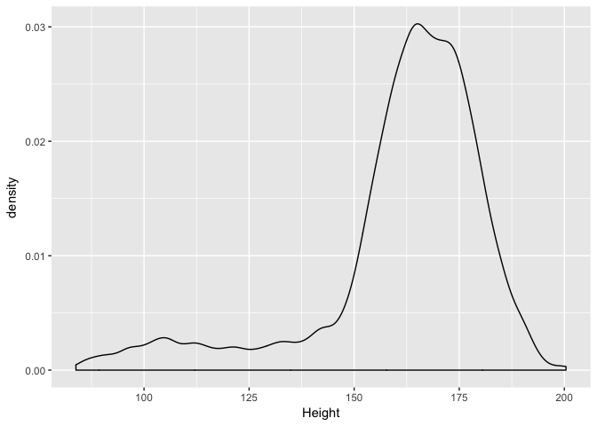

Back to histograms. What if we wanted to color this by Race?

``` r
p + geom_histogram(aes(color=Race))
```

    ## `stat_bin()` using `bins = 30`. Pick better value with `binwidth`.

    ## Warning: Removed 159 rows containing non-finite values (stat_bin).

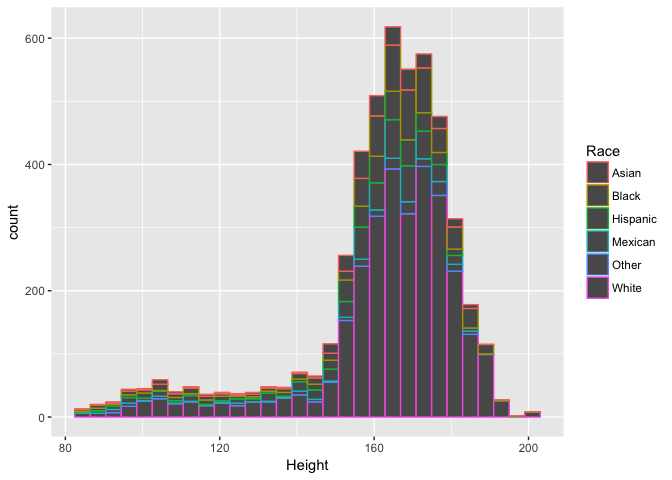

That's not what we had in mind. That's just the outline of the bars. We want to change the *fill* color of the bars.

``` r
p + geom_histogram(aes(fill=Race))
```

    ## `stat_bin()` using `bins = 30`. Pick better value with `binwidth`.

    ## Warning: Removed 159 rows containing non-finite values (stat_bin).

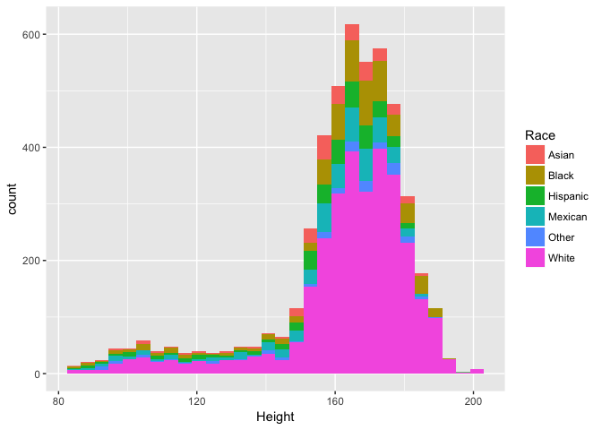

Well, that's not exactly what we want either. If you look at the help for `?geom_histogram` you'll see that by default it stacks overlapping points. This isn't really an effective visualization. Let's change the position argument.

``` r
p + geom_histogram(aes(fill=Race), position="identity")
```

    ## `stat_bin()` using `bins = 30`. Pick better value with `binwidth`.

    ## Warning: Removed 159 rows containing non-finite values (stat_bin).

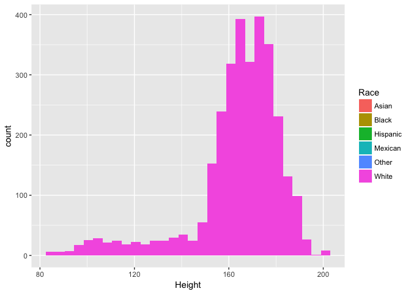

Now the problem is that the histograms are blocking each other. What if we tried transparency?

``` r
p + geom_histogram(aes(fill=Race), position="identity", alpha=1/3)
```

    ## `stat_bin()` using `bins = 30`. Pick better value with `binwidth`.

    ## Warning: Removed 159 rows containing non-finite values (stat_bin).


That's somewhat helpful, and might work for two distributions, but it gets cumbersome with 5. Let's try this with density plots, first changing the color of the line:

``` r
p + geom_density(aes(color=Race), lwd = 2)
```

    ## Warning: Removed 159 rows containing non-finite values (stat_density).

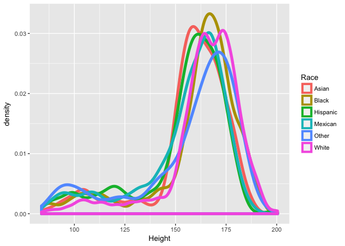

Then by changing the color of the fill and setting the transparency to 25%:

``` r
p + geom_density(aes(color = Race, fill=Race), alpha=1/4)
```

    ## Warning: Removed 159 rows containing non-finite values (stat_density).


### Faceting

Facets display subsets of the data in different panels. There are a couple ways to do this, but `facet_wrap()` tries to sensibly wrap a series of facets into a 2-dimensional grid of small multiples. Just give it a formula specifying which variables to facet by. If you have a look at the help for `?facet_wrap()` you'll see that we can control how the wrapping is laid out.

Remember how our histograms of height by Race were not easy to read when they were overlapping? Perhaps a good solution instead of transparency, is to facet.

``` r
nh %>%
  ggplot(aes(Height)) +
  geom_histogram(aes(fill = Race), position = "identity")
```

    ## `stat_bin()` using `bins = 30`. Pick better value with `binwidth`.

    ## Warning: Removed 159 rows containing non-finite values (stat_bin).


``` r
#facet histograms by race
nh %>%
  ggplot(aes(Height)) +
  geom_histogram(aes(fill = Race), position = "identity") +
  facet_wrap(~Race)
```

    ## `stat_bin()` using `bins = 30`. Pick better value with `binwidth`.

    ## Warning: Removed 159 rows containing non-finite values (stat_bin).


``` r
#facet density plots by Race
nh %>%
  ggplot(aes(Height)) +
  geom_density() +
  facet_wrap(~Race)
```

    ## Warning: Removed 159 rows containing non-finite values (stat_density).


### Choosing colors and themes

``` r
# boxplot of BMI by Smoking status without missing Smoking Status
nh %>%
  filter(!is.na(SmokingStatus)) %>%
  ggplot(aes(x = SmokingStatus, y = BMI)) + 
  geom_boxplot()
```

    ## Warning: Removed 31 rows containing non-finite values (stat_boxplot).


``` r
#colored by Diabetes
nh %>%
  filter(!is.na(SmokingStatus)) %>%
  ggplot(aes(x = SmokingStatus, y = BMI)) + 
  geom_boxplot(aes(fill = Diabetes))
```

    ## Warning: Removed 31 rows containing non-finite values (stat_boxplot).

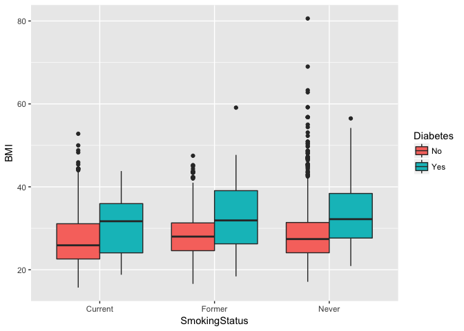

``` r
# colors()

#change colors manually
nh %>%
  filter(!is.na(SmokingStatus)) %>%
  ggplot(aes(x = SmokingStatus, y = BMI)) + 
  geom_boxplot(aes(fill = Diabetes)) +
  scale_fill_manual(values = c("cornflowerblue", "coral1"))
```

    ## Warning: Removed 31 rows containing non-finite values (stat_boxplot).


``` r
#change theme
nh %>%
  filter(!is.na(SmokingStatus)) %>%
  ggplot(aes(x = SmokingStatus, y = BMI)) + 
  geom_boxplot(aes(fill = Diabetes)) +
  scale_fill_manual(values = c("cornflowerblue", "coral1")) +
  theme_bw()
```

    ## Warning: Removed 31 rows containing non-finite values (stat_boxplot).


### \*\* EXERCISE 4 ** ** YOUR TURN \*\* Practice creating the plots pictured below

1.  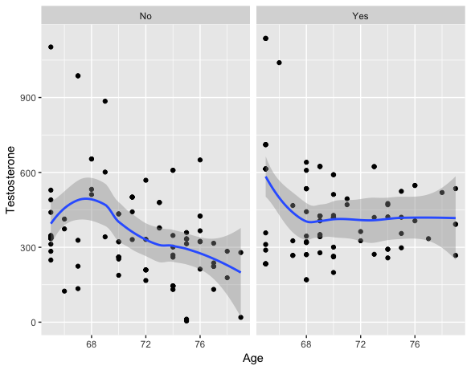 <br> No = not physically active, Yes = physically active

2.  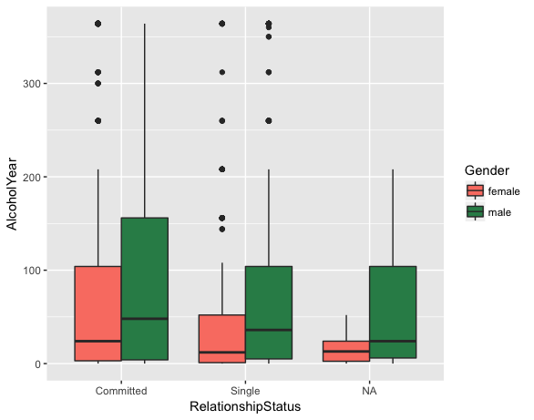 <br> Custom colors are "salmon" and "seagreen"

3.  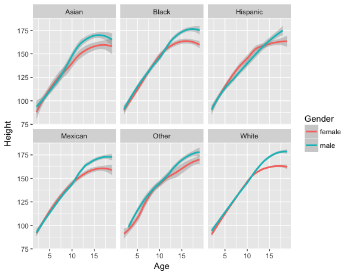 <br>

``` r
#A
nh %>%
  filter(Gender == "male" & Age >= 65 & Age < 80) %>%
  ggplot(aes(Age, Testosterone)) +
  geom_point() +
  facet_wrap(~PhysActive) +
  geom_smooth()
```

    ## `geom_smooth()` using method = 'loess'

    ## Warning: Removed 17 rows containing non-finite values (stat_smooth).

    ## Warning: Removed 17 rows containing missing values (geom_point).

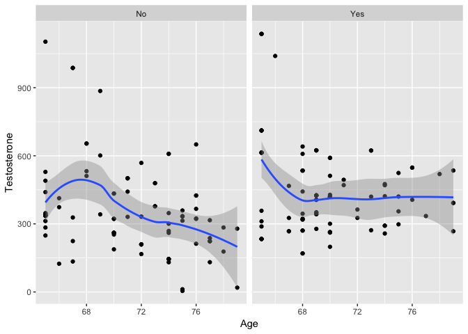

``` r
#B
nh %>%
  ggplot(aes(x = RelationshipStatus, y = AlcoholYear, fill = Gender)) +
  geom_boxplot() +
  scale_fill_manual(values = c("salmon", "seagreen"))
```

    ## Warning: Removed 2016 rows containing non-finite values (stat_boxplot).


``` r
#C
nh %>%
  filter(Age < 20) %>%
  ggplot(aes(x = Age, y = Height)) +
  geom_smooth(aes(color = Gender)) +
  facet_wrap(~ Race)
```

    ## `geom_smooth()` using method = 'loess'

    ## Warning: Removed 133 rows containing non-finite values (stat_smooth).

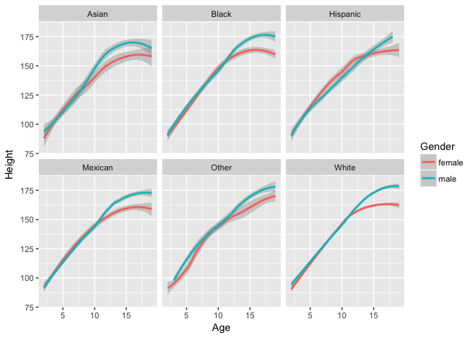
